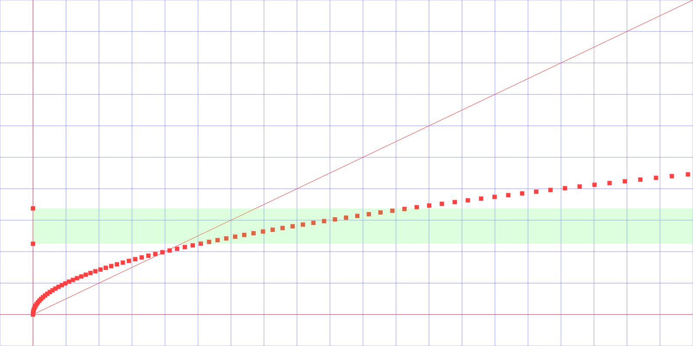

# Dumb Sqrt Algorithm Visualization

[](http://tsoding.org/dumb-sqrt/)

## Quick Start

```console
$ iexplore.exe index.html
```

## Controls

Use left and right arrows to move between the states of the algorithm.
Use up and down arrows to change argument of Sqrt function.

## Font

[Libre Baskerville](https://github.com/impallari/Libre-Baskerville)
